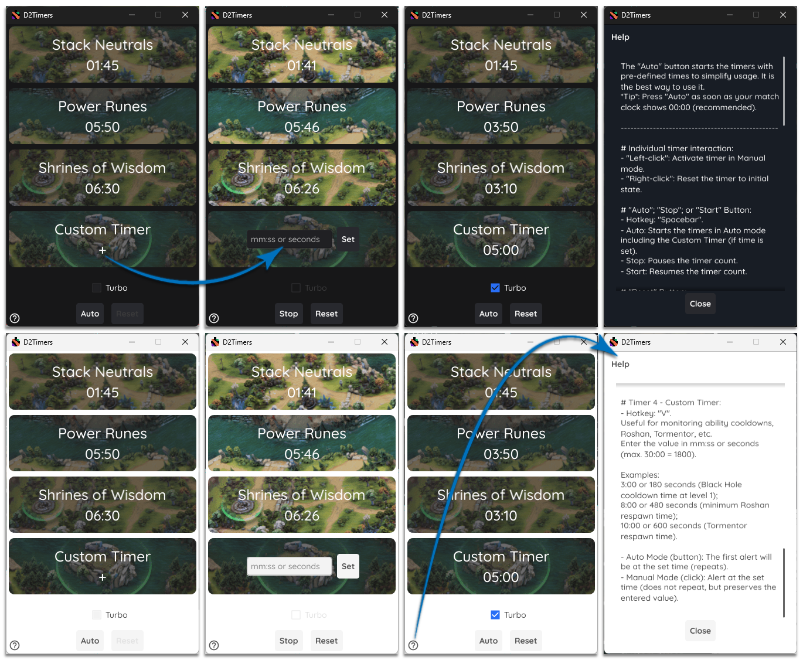

# D2Timers

## Introduction

D2Timers is a tool that aims to facilitate the achievement of objectives in DotA 2.
Anyone interested can use it, of course, but it was created with "habit building" in mind for less experienced players. More experienced players should always challenge themselves to improve their skills. So use it sparingly.

## What it is

To be clear: This is not a game cheat! There is no game integration. No one information is captured from your game and no overlays are set on you screen.

This is a standalone app. Its a timer aplication, configured to emit an audible alert on specific game timers (Normal and Turbo Mode are available). You need to interact manualy.

## Downloads

[Github](https://github.com/thyagoleao/d2timers/releases) is the only source where you can get official D2Timers information and downloads.

Download **D2Timers.zip** for Windows in release section. You will find the Linux version in .tar.xz.

## How to use

There is two ways to use this aplication.

Clicking on individual timers or just pressing Auto button.

The "Auto" button starts the timers with pre-defined times to simplify usage. It is the best way to use it. *Tip*: Press "Auto" as soon as your match clock shows 00:00 (recommended).

- **Individual timer interaction:**
  
  - "Left-click": Activate timer in Manual mode.
  
  - "Right-click": Reset the timer to initial state.

- **"Auto"; "Stop"; or "Start" Button:**
  
  - Hotkey: "Spacebar".
  
  - Auto: Starts the timers in Auto mode including the Custom Timer (if time is set).
  
  - Stop: Pauses the timer count.
  
  - Start: Resumes the timer count.

- **"Reset" Button:**
  
  - Hotkey: "R".
  
  - Resets all timers to the initial state. 

- **Turbo Mode:**
  
  - Hotkey: "T".
  
  - Set timers for "Turbo Mode".

## About Timers

- **Timer 1 - Stack Neutrals**:
  
  - Hotkey: Z
  
  - Normal/Turbo Mode (auto): First alert at 1:45 (repeats every 1 minute).
  
  - Normal/Turbo Mode (manual): Alert at 1:00 (repeats).

- **Timer 2 - Power Runes**:
  
  - Hotkey: X
  
  - Normal Mode (auto): First alert at 5:50 (repeats every 2 minutes).
  
  - Normal Mode (manual): Alert at 2:00 (repeats).
  
  - Turbo Mode (auto): First alert at 3:50 (repeats every 2 minutes).
  
  - Turbo Mode (manual): Alert at 2:00 (repeats).

- **Timer 3 - Shrines of Wisdom**:
  
  - Hotkey: C
  
  - Normal Mode (auto): First alert at 6:30 (repeats every 7 minutes).
  
  - Normal Mode (manual): Alert at 7:00 (repeats).
  
  - Turbo Mode (auto): First alert at 3:30 (repeats every 4 minutes).
  
  - Turbo Mode (manual): Alert at 4:00 (repeats).

- **Timer 4 - Custom Timer**:
  
  You need to setup a value in mm:ss or seconds (max. 30:00 = 1800).
  Useful for monitoring ability cooldowns, Roshan, Tormentor, etc.
  
  - Hotkey: V
  
  - Normal/Turbo Mode (auto): The first alert will be at the set time (repeats).
  
  - Normal/Turbo Mode (manual): Alert at the set time (does not repeat, but preserves the entered value).
    
    - Examples:
      
      3:00 or 180 seconds (Black Hole cooldown time at level 1);
      
      8:00 or 480 seconds (minimum Roshan respawn time);
      
      10:00 or 600 seconds (Tormentor respawn time).

## Visual

 The modern and minimalist Material based interface wil match the Dark or Light mode from your system and it is easy to use.

## Translation

The translation will be set according to your current system language and includes: English, portuguese, spanish and russian.

Note all translations was generated by AI and may contain errors. Please report it.

## Bug Reports

I've only tested this app on Windows. But I'm pretty sure it will work fine on Linux as well.

You can let me know in the issues section.

## License

    D2Timers, including all git submodules are free software:
    you can redistribute it and/or modify it under the terms of the
    GNU General Public License as published by the Free Software Foundation,
    either version 3 of the License, or (at your option) any later version.
    
    This program is distributed in the hope that it will be useful,
    but WITHOUT ANY WARRANTY; without even the implied warranty of
    MERCHANTABILITY or FITNESS FOR A PARTICULAR PURPOSE.  See the
    GNU General Public License for more details.
    
    You should have received a copy of the GNU General Public License
    along with this program.  If not, see <http://www.gnu.org/licenses/>.

*This application is made by fan and is not an officially supported Valve Corporation product.*
